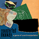
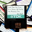
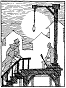

I've decided to list these according to the I7 build used to produce their latest release. For those of us who are interested in such things, this should make it obvious which of these examples can be easily recompiled and which of them may require extra effort.

_I think this is important because source code examples are more useful to me if they compile. If I reuse code from a compiling example and my efforts don't compile, it's obvious that it's my efforts that are the problem and not the code example. Of course, this is more of an issue for examples developed using older versions of the Inform 7 compiler._

An archive of old releases of Inform 7 is [available here](https://ganelson.github.io/inform-website/downloads/) for anyone who wishes to recompile older games. You may also need the [Archive of Inform 7 Extensions](https://github.com/i7/archive). However, this doesn't contain all versions of all extensions.

Many thanks to all the authors who have so generously released their source code to the rest of the IF Community.

## Classics on IFDB

# 6M62

{:style="float: left;margin-right: 15px;margin-top: 5px;"}
[Inform 7 Dungeon (Zork)](https://sourceforge.net/projects/i7-dungeon/files/), by Dean Menezes (2008).

Hosted by [SourceForge](https://sourceforge.net/).
An Inform 7 version of the FORTRAN game "Dungeon" which is itself a translation of the original Zork game developed at MIT between 1977 and 1981.
This is published as an Inform 7 story file with related source code and compiles with no problems.

_The project was originally developed using I7 builds 4X60 to 5T18 but has more recently been imported to [Inform 7 Examples](https://github.com/I7-Examples) and [updated to I7 build 6M62](https://github.com/I7-Examples/Zork)._

## Highest Rated on IFDB

# 6M62

{:style="float: left;margin-right: 15px;margin-top: 5px;"}
[Counterfeit Monkey](https://github.com/i7/counterfeit-monkey), by Emily Short (2012).

Hosted by [Friends of Inform 7](https://github.com/i7) on GitHub.
This is published as an Inform 7 project, complete with the required extensions, and compiles with no problems.

{:style="float: left;margin-right: 15px;margin-top: 5px;"}
[And Then You Come to a House Not Unlike the Previous One](https://github.com/bjbest60/HouseNotUnlike), by B.J. Best (2021).

Hosted by [B.J. Best](https://github.com/bjbest60) on GitHub.
This is published as Inform 7 source code and compiled story along with cover images and a pdf guide.

_A necessary extension, Hybrid Choices version 4 by AW Freyr, is missing and no longer available. The source code can be compiled using Hybrid Choices version 7._

# 6L02

{:style="float: left;margin-right: 15px;margin-top: 5px;"}
[Slouching Towards Bedlam](http://www.peccable.com/if/slouching-10/), by Star Foster and Daniel Ravipinto (2003).

Hosted by [Peccable Productions](http://www.peccable.com/).
This is published as an [Inform 7 website](http://www.peccable.com/if/slouching-10/src/). A single required extension is [provided](http://www.peccable.com/if/slouching-10/Titled%20Menus.i7x) but the version is the one required to support [Release 1](http://www.peccable.com/if/slouching-10/src-release-1/) which was developed using I7 build 6G60.

_It is quite straightforward to update the extension. Once this is done, the release 2 source code can be compiled using I7 build 6L02._

# 6G60

{:style="float: left;margin-right: 15px;margin-top: 5px;"}
[Hadean Lands](https://hadeanlands.com/src/), by Andrew Plotkin (2014).

Hosted at [it's own website](https://hadeanlands.com/).
This is published in the form of web pages and is therefore not directly compilable.

_The source code can be reconstituted from the web pages. Once this is done, it can be compiled using I7 build 6G60 augmented with I6 version 6.34._

# 5Z71

{:style="float: left;margin-right: 15px;margin-top: 5px;"}
[Blue Lacuna](https://aareed.itch.io/blue-lacuna), by Aaron A. Reed (2008).

Hosted by [itch.io](https://itch.io/).
This is published as an itch.io source code download, complete with the required extensions, and compiles with no problems.

