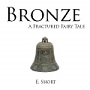
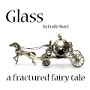
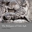
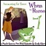
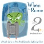

The latest versions of the reconstructed game websites can be accessed from here.

{:style="float: left;margin-right: 15px;margin-top: 5px;"}
[Bronze](https://i7-examples.github.io/Bronze/), by Emily Short (2006).

A puzzle-oriented adaptation of Beauty and the Beast with an expansive geography for the inveterate explorer. Features a detailed adaptive hint system to assist players who get lost, as well as a number of features to make navigating a large space more pleasant.

{:style="float: left;margin-right: 15px;margin-top: 5px;"}
[Damnatio Memoriae](https://i7-examples.github.io/Damnatio-Memoriae/), by Emily Short (2006).

14 AD. Agrippa Postumus, grandson of the recently-deceased Augustus, tries to avoid death at the hands of the next emperor, Tiberius. At his disposal: a couple of old manuscripts, a lamp, and a recalcitrant slave. And a powerful knowledge of the occult affinities of things.

{:style="float: left;margin-right: 15px;margin-top: 5px;"}
[Glass](https://i7-examples.github.io/Glass/), by Emily Short (2006).

A conversation-oriented adaptation of Cinderella, taking place in one room. Features non-player characters who seek to bring about certain conversational resolutions, a variety of additional verbs, and a narrative with multiple endings.

{:style="float: left;margin-right: 15px;margin-top: 5px;"}
[The Reliques of Tolti-Aph](https://i7-examples.github.io/The-Reliques-of-Tolti-Aph/), by Graham Nelson (2005).

This piece of nonsense started from a feeling that the Inform documentation examples showed off many IF-like situations involving the modelling of landscape, people and items, but not much that resembled traditional computer programming. To force it to involve some interesting coding, ROTA was devised as a role-playing game, involving lots of randomness, book-keeping and even the dynamic creation of a map during play.

{:style="float: left;margin-right: 15px;margin-top: 5px;"}
[When in Rome 1: Accounting for Taste](https://i7-examples.github.io/When-in-Rome-1/), by Emily Short (2006).

Manhattan, May, 1954. The last few years, you've settled into a routine. You work at the bank, you go home, you occasionally have dinner with your mother. It is all acceptably ordinary... One day a strange creature crosses your path, and disrupts the schedule entirely. When in Rome is designed as a lunchtime game: there are five episodes, each of which may be played to a conclusion within about fifteen minutes.

{:style="float: left;margin-right: 15px;margin-top: 5px;"}
[When in Rome 2: Far from Home](https://i7-examples.github.io/When-in-Rome-2/), by Emily Short (2006).

No one can know the truth. Even your mother thinks you've set yourself up as a Private Investigator. The rest of the secret had better stay between you, your secretary Esther, and your autographed photo of Joe DiMaggio.
